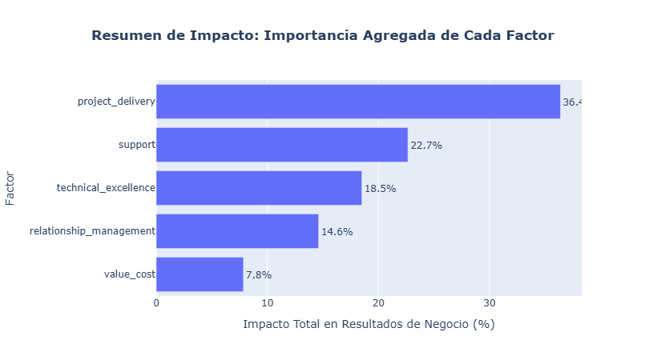

# Customer Satisfaction Case Study - TechnoServe Solutions

**Authors:** 
- Diego Colin Reyes
- Daniel Alejandro López Martínez
- Eduardo Ramírez Almanza

---

## 1. Business Context
**Client Description & Problem:**
**TechnoServe Solutions** es una empresa que busca la excelencia en el servicio, pero carece de un entendimiento claro y cuantitativo sobre qué factores específicos están impulsando o minando la **satisfacción del cliente** (*Customer Satisfaction*). La empresa necesita transformar más de **3,400 encuestas** en un conjunto de *drivers* de negocio accionables. El problema principal es la incapacidad de **priorizar** las inversiones estratégicas que tienen el mayor impacto en los resultados clave del negocio.

**Strategic Importance:**
Este estudio convierte datos de satisfacción en un **modelo de impacto predictivo**. Al comprender y priorizar los factores de satisfacción, TechnoServe Solutions puede:
* Dejar de invertir en áreas de bajo impacto y **enfocar recursos** en los verdaderos *drivers* de la lealtad.
* Predecir el comportamiento del cliente, como la **probabilidad de renovación** (`renewal_likelihood`) y el **Net Promoter Score (NPS)**.
* Implementar acciones concretas (como la modernización de soporte y entrega de proyectos) que transformen la operación de **reactiva a proactiva**.
* Impactar directamente en el **Valor de Vida del Cliente (CLV)**, la **tasa de abandono (*churn*)** y el **crecimiento de ingresos**.

---

## 2. Methodology
**Multivariate Method Applied:**
Se empleó una metodología de dos fases:
1.  **Análisis Factorial Exploratorio (EFA)**: Utilizado para reducir las 23 variables de satisfacción en un número menor de **Factores Latentes** o constructos subyacentes.
2.  **Modelado Predictivo (Random Forest / XGBoost)**: Utilizado para entrenar un modelo de regresión que predice las **variables de resultado** del negocio (NPS, Satisfacción General, etc.) utilizando los factores latentes como *features*.

**Justification:**
* **Preparación de Datos**: Se aplicó la técnica de **imputación de valores faltantes KNNImputer** ($k=5$) para tratar los datos nulos, particularmente en variables como `trust_reliability` y `problem_solving`.
* **Idoneidad para EFA**: La medida **KMO (Kaiser-Meyer-Olkin)** se calculó con un valor de **0.959**, lo que justificó de manera sólida el uso del Análisis Factorial para la reducción de dimensionalidad.
* **Modelo Híbrido**: La combinación de EFA y modelado predictivo (Random Forest) permitió no solo identificar los *drivers* (EFA) sino también cuantificar su **importancia relativa** en el impacto sobre los resultados clave del negocio.

**Tools & Libraries:**
* **Python**: Lenguaje de programación central.
* **Pandas & NumPy**: Manipulación y limpieza de datos.
* **Scikit-learn**: `StandardScaler`, `KNNImputer`, `RandomForestRegressor`.
* **FactorAnalyzer**: Implementación de Análisis Factorial Exploratorio.
* **XGBoost**: Librería para el modelado predictivo avanzado (importada en `main.ipynb`).
* **Plotly**: Visualizaciones interactivas de resultados.

---

## 3. Data
**Dataset Description:**
El análisis se basó en un conjunto de datos que consolidó **más de 3,400 encuestas** provenientes de **850 clientes** únicos. El conjunto de datos inicial consta de **31 variables** y **3400 observaciones**.

**Key Variables:**
El conjunto de variables se dividió en dos grupos:

* **Variables de Satisfacción (Inputs - 23 variables):**
    * Agrupadas en 5 dimensiones iniciales: Excelencia Técnica, Gestión de Relaciones, **Entrega de Proyectos**, Valor y Costo, y **Soporte**.
    * Ejemplos: `timeline_adherence`, `budget_control`, `trust_reliability`.
* **Variables de Resultado (Outputs - 5 variables):**
    * `overall_satisfaction` (Satisfacción general)
    * `nps_score` (Puntuación NPS)
    * `renewal_likelihood` (Probabilidad de renovación)
    * `revenue_growth_pct` (Crecimiento porcentual de ingresos)
    * `referrals_generated` (Referidos generados)

**Data Dictionary:**
* [Link to Data Dictionary / Raw File](#) *(Placeholder para el enlace del repositorio)*

---

## 4. Key Findings
El análisis concluyó que la combinación de Factor Analysis y Random Forest es clave para la toma de decisiones, ya que permite priorizar los factores según su **impacto agregado** en las métricas de negocio.

**Factores Críticos (Identificados por su mayor impacto):**
Aunque el nombre exacto de los factores latentes se encuentra en el reporte completo (basado en los *loadings*), las áreas clave que dominan el impacto son:
1.  **Modernización de la Entrega de Proyectos:** Factores relacionados con la ejecución, la gestión del cambio y el control de los entregables.
2.  **Modernización del Soporte:** Factores relacionados con la eficiencia, la proactividad y la disponibilidad de soluciones.

**Modelo de Desempeño:**
El modelo predictivo basado en Random Forest se utilizó para cuantificar el impacto de los factores en las variables de resultado, mostrando la importancia relativa de cada uno de ellos para predecir **Satisfacción General, NPS y Renovación**.

**Featured Visualization:**
*(Gráfico de Barras de Impacto: Importancia Agregada de Cada Factor en los Resultados de Negocio)*

*Nota: Este gráfico visualiza los factores de satisfacción ordenados por su influencia total en las métricas de negocio.*

---

## 5. Business Recommendations

Las iniciativas estratégicas se agrupan en dos pilares que buscan transformar la operación de **reactiva a proactiva**:

1.  **Modernización de la Entrega de Proyectos:**
    * **Implementar una PMO (Oficina de Gestión de Proyectos):** Para estandarizar procesos y asegurar la mejora en la **adherencia al *timeline*** (`timeline_adherence`) y el **control presupuestario** (`budget_control`).
    * **Mejorar la Gestión del Cambio:** Implementar documentación estructurada y sesiones de *kick-off* con el cliente para minimizar las desviaciones y el retrabajo.

2.  **Modernización del Soporte y Post-Venta:**
    * **Fomentar la Proactividad y el Auto-servicio:** Ofrecer **capacitación proactiva** (rutas de aprendizaje, biblioteca bajo demanda) y bases de conocimiento con micro-tutoriales.
    * **Estructurar la Atención Reactiva:** Implementar un sistema escalonado de tickets con **SLAs claros** (Acuerdos de Nivel de Servicio) para mejorar la **eficiencia operativa**.

**Expected Impact:**
* **Aumento de Márgenes:** Reducción de costos por retrabajos y desviaciones en los proyectos.
* **Disminución de *Churn* (Abandono):** Mayor retención de clientes por la mejora del soporte y la fiabilidad.
* **Incremento de CLV:** Clientes más satisfechos se retienen por más tiempo e **incrementan su valor de vida**.

**Next Steps:**
* **Diseño de la PMO:** Formalizar los *workflows* para los factores de Entrega de Proyectos de mayor impacto.
* **Lanzamiento de la Plataforma de Auto-servicio:** Priorizar la creación de bases de conocimiento para las preguntas más frecuentes identificadas en el análisis de tickets de soporte.