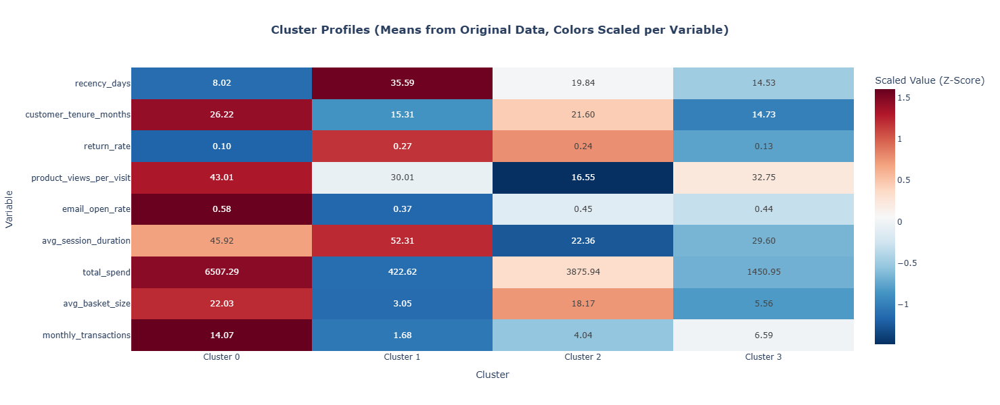

# MegaMart Customer Segmentation Analysis

**Authors:** 

- Diego Colin Reyes
- Daniel Alejandro López Martínez
- Eduardo Ramírez Almanza

---

## 1. Business Context
**Client Description & Problem:**
MegaMart is a retail platform currently facing challenges with a "one-size-fits-all" marketing approach. The company possesses a rich dataset of 3,000 customers containing behavioral metrics (spending, browsing, and returns) but lacks a structured way to categorize these customers. The primary problem is the inability to distinguish between high-value loyalists, churn-risk customers, and new potential shoppers, leading to inefficient marketing spend.

**Strategic Importance:**
This analysis transforms raw behavioral data into actionable customer segments. By understanding distinct customer profiles, MegaMart can:
* Transition from generic mass marketing to personalized targeting.
* Identify and retain the most profitable customers (VIPs).
* Address specific pain points, such as high return rates in otherwise valuable segments.
* Optimize resource allocation by focusing retention efforts on high-potential groups.

---

## 2. Methodology
**Multivariate Method Applied:**
We utilized **Unsupervised Machine Learning**, specifically comparing **Hierarchical Clustering (Ward's Method)** and **K-Means Clustering**. Principal Component Analysis (PCA) was used for dimensionality reduction to visualize the final clusters.

**Justification:**
* **Standardization:** Applied `StandardScaler` to ensure variables with large ranges (e.g., `total_spend`) did not dominate variables with small ranges (e.g., `email_open_rate`).
* **Model Selection:** K-Means was selected for the final model due to its efficiency and the distinct separation of groups.
* **Validation:** The optimal number of clusters ($k=4$) was determined using a convergence of three methods:
    1.  **Elbow Method:** Showed a clear inflection point at $k=4$.
    2.  **Silhouette Score:** Analysis confirmed $k=4$ offered the most stable and interpretable structure (Score: ~0.32) without over-segmenting.
    3.  **Dendrogram:** Visual inspection of the Ward linkage tree confirmed a significant cut point for 4 groups.

**Tools & Libraries:**
* **Python**: Core programming language.
* **Pandas & NumPy**: Data manipulation and cleaning.
* **Scikit-learn**: PCA, K-Means, Hierarchical Clustering, and validation metrics.
* **Plotly & SciPy**: Interactive visualizations and dendrogram generation.

---

## 3. Data
**Dataset Description:**
The analysis is based on `retail_customer_data.csv`, containing **3,000** unique customer records with **10** columns. The dataset is complete with no missing values.

**Key Variables:**
* **Monetary/Transaction:** `total_spend`, `monthly_transactions`, `avg_basket_size`.
* **Engagement:** `avg_session_duration`, `product_views_per_visit`, `email_open_rate`.
* **Retention/Loyalty:** `customer_tenure_months`, `recency_days`, `return_rate`.

**Data Dictionary:**
* [Link to Data Dictionary / Raw File](#) *(Placeholder for repository link)*

---

## 4. Key Findings
The analysis identified **4 distinct customer profiles** ($k=4$):

* **Cluster 0 - "The Elite" (17.5%):** High spenders, frequent shoppers, highly engaged digitally, and low return rates. They are the most profitable segment.
* **Cluster 1 - "At-Risk / Disengaged" (31%):** Lowest spending, high recency (haven't shopped recently), and high return rates. They show signs of churning.
* **Cluster 2 - "Efficient Big Spenders" (14.4%):** High total spend and basket size, but they shop quickly (low duration/views). **Critical Insight:** They have a high return rate, which eats into their profitability.
* **Cluster 3 - "New Growth Potential" (37.1%):** Newer customers with frequent small transactions. They are active but have not yet developed high basket sizes.

**Model Performance:**
* **Silhouette Score:** 0.3173 (Indicates reasonable separation with some expected overlap in behavioral data).

**Featured Visualization:**
*(Cluster Profiles Heatmap: Z-Scores of behavioral variables by Cluster)*

*Note: See the full report for the interactive Plotly heatmap.*

---

## 5. Business Recommendations

1.  **Launch a VIP Loyalty Program (Target: Cluster 0):**
    * Since these are high-spend, low-return customers, focus on retention. Offer exclusive early access to products to maintain their high engagement.
2.  **Investigate Return Logistics (Target: Cluster 2):**
    * This group spends heavily but returns frequently. Implement a feedback loop to understand if products are defective or descriptions are misleading. A personalized "sizing guide" or "consultation" could reduce returns and double profitability.
3.  **Nurture Campaign (Target: Cluster 3):**
    * These are frequent but low-value shoppers. Use "bundle deals" or "threshold discounts" (e.g., "$10 off when you spend $100") to increase their Average Basket Size.

**Expected Impact:**
* **Increase CLV:** By moving Cluster 3 into the spending habits of Cluster 0.
* **Cost Reduction:** By lowering the return rate in Cluster 2.
* **Churn Prevention:** By re-engaging Cluster 1 via win-back email campaigns.

**Next Steps:**
* Deploy the K-Means model to the production pipeline to tag new customers daily.
* A/B test the suggested "Bundle Deal" marketing campaign on Cluster 3.
